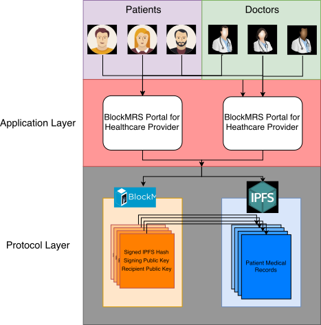

bettersoul
======================================
Sports Medical Records on a Blockchain
^^^^^^^^^^^^^^^^^^^^^^^^^^^^^^^^^^^^^^

bettersoul is a privacy concious, decentralized, blockchain-backed, medical
record system for the 21st Century.

It stores patient records in IPFS using state-of-the art asymetric encryption
giving patients control over their health data.

Privacy Concious
----------------

bettersoul is designed with the patient's privacy in mind.  bettersoul generates a
new public-private key for every transaction on the blockchain and each block
has a constant size. This ensures that malicious actors cannot infer anything
about a patient by inspecting the blockchain.

Distributed
-----------
bettersoul uses a distrubuted filesystem called *InterPlanetary File System
(IPFS)* to store medical records. This creates a common way for medical service
providers to access the latest, up-to-date patient data.

Blockchain-Backed
-----------------
bettersoul takes advantage of the latest blockchain technology to allow for
seamless transfer of medical data. Blocks on the blockchain are signed and
ecrypted to ensure authenticity and privacy.

System Architecture
-------------------

